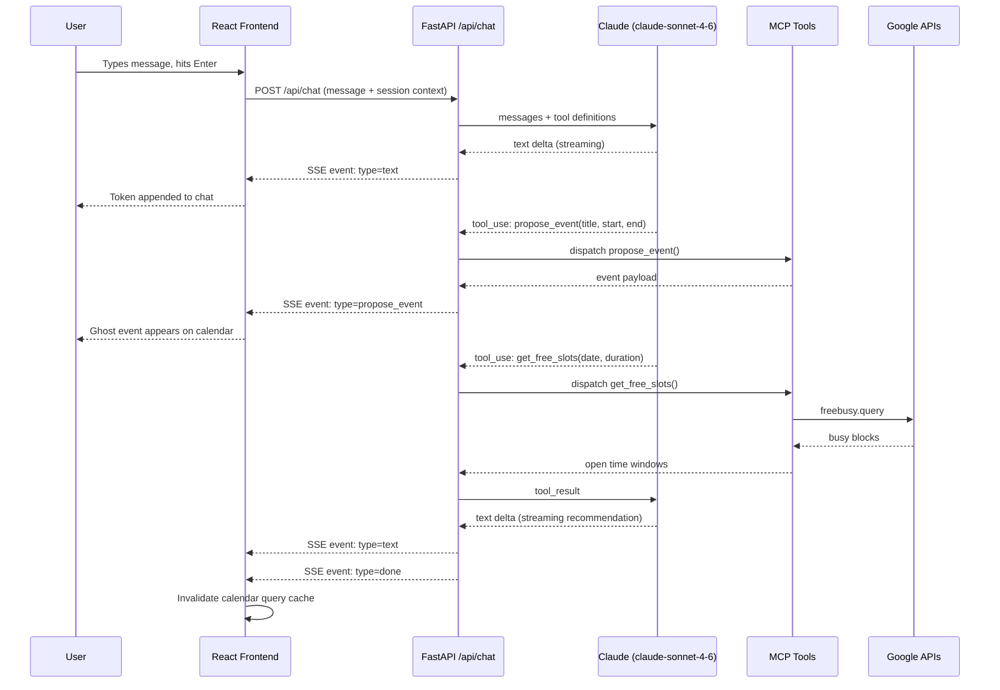
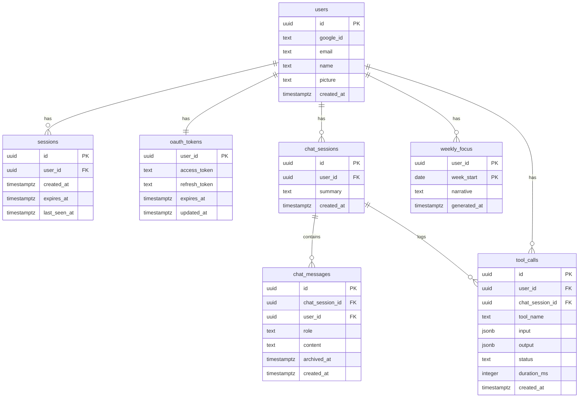

# CalendarAssistant

A web app that connects to your Google account and lets you view your calendar alongside an AI agent you can talk to. Ask it to schedule meetings, find open time slots, draft scheduling emails, or surface patterns in how you spend your time. The agent can propose events as ghost blocks on the calendar, switch views, and generate weekly meeting analytics — all through a natural language chat interface.

---

## Quick Start

### Prerequisites

- Node.js 20+
- Python 3.12+
- PostgreSQL with `pgvector` extension
- A Google Cloud project (see setup below)

### 1. Clone and install

```bash
git clone https://github.com/blanksonk/CalendarAssistant.git
cd CalendarAssistant

# Frontend
cd client && npm install && cd ..

# Backend
cd server && python -m venv .venv && source .venv/bin/activate
pip install -r requirements.txt && cd ..
```

### 2. Environment variables

Create `server/.env`:

```bash
GOOGLE_CLIENT_ID=
GOOGLE_CLIENT_SECRET=
GOOGLE_REDIRECT_URI=http://localhost:8000/api/auth/google/callback
ANTHROPIC_API_KEY=
VOYAGE_API_KEY=
DATABASE_URL=postgresql+asyncpg://localhost/calendarassistant
SESSION_SECRET=          # openssl rand -hex 32
ENCRYPTION_KEY=          # python -c "from cryptography.fernet import Fernet; print(Fernet.generate_key().decode())"
CORS_ORIGIN=http://localhost:5173
```

### 3. Google Cloud Console setup

1. Create a project and enable: **Google Calendar API**, **Gmail API**, **Google People API**
2. OAuth Consent Screen → External → add scopes:
   `calendar.events`, `calendar.readonly`, `gmail.compose`, `userinfo.email`, `userinfo.profile`
3. Credentials → OAuth 2.0 Client ID → Web application
   - Dev redirect URI: `http://localhost:8000/api/auth/google/callback`
4. Copy Client ID and Client Secret into `server/.env`

### 4. Database

```bash
source server/.venv/bin/activate
cd server && alembic upgrade head
```

### 5. Run

```bash
npm run dev   # starts React on :5173 and FastAPI on :8000
```

Open `http://localhost:5173`, sign in with Google, and start chatting.

---

## Running Tests

### Frontend unit tests (Vitest)

```bash
cd client && npx vitest
```

### Frontend E2E tests (Playwright — no Google account needed)

All API calls are intercepted with `page.route()` mocks. No real backend or credentials required.

```bash
cd client && npx playwright test
```

### Backend tests (pytest)

```bash
source server/.venv/bin/activate
PYTHONPATH=. pytest server/tests/
```

No real database or external API calls are made in tests — all dependencies are mocked via `AsyncMock` and `pytest-mock`.

---

## Architecture

### System Overview

```
Browser (React + Vite)
        │  HTTP REST + Server-Sent Events (SSE)
        ▼
FastAPI (Python)
  ├── Auth routes        → Google OAuth 2.0 flow
  ├── Calendar routes    → Google Calendar API
  ├── Chat route         → Claude agent loop (SSE stream)
  ├── Insights route     → On-demand metrics computation
  ├── People route       → Google People API contact search
  ├── MCP module (in-memory)
  │     ├── list_events()
  │     ├── get_free_slots()
  │     ├── propose_event()       → ghost event via SSE to frontend
  │     ├── create_gmail_draft()
  │     ├── compute_insights()
  │     ├── generate_weekly_focus()
  │     └── switch_tab()          → tab navigation via SSE to frontend
  └── Session middleware → cookie → sessions table → user_id
        │
        ▼
PostgreSQL + pgvector
        │
        ▼
External: Google Calendar API, Gmail API, People API, Anthropic API, Voyage AI
```

### Chat → Agent → UI Sequence



### Database Schema



---

## Key Design Decisions

**1. In-process MCP server**
The MCP tool server runs inside the FastAPI process rather than as a separate stdio or HTTP service. This preserves the MCP tool structure and discoverability without adding a second service to deploy. It can be extracted into a standalone HTTP server later if independent scaling is needed.

**2. SSE for agent → UI communication**
The chat endpoint returns a `text/event-stream` response. Typed SSE events (`propose_event`, `switch_tab`, `done`) let the agent reach into frontend state — placing ghost events on the calendar or switching tabs — without any polling or WebSocket infrastructure.

**3. Server-side sessions over JWTs**
Sessions are stored in PostgreSQL (UUID cookie → `sessions` table row). Logout is a single `DELETE` — the token is immediately invalid with no grace period or blocklist needed. JWTs were rejected because they can't be server-side invalidated.

**4. Ghost events in Zustand, not the database**
Agent-proposed events live exclusively in frontend state (Zustand store) and appear as ghost blocks across all three calendar views simultaneously. They're never written to the database. A `beforeunload` warning fires if the user tries to close the tab with pending events outstanding.

**5. Fernet encryption for OAuth tokens at rest**
Google access and refresh tokens are encrypted with Fernet symmetric encryption before being written to `oauth_tokens`. The key lives in `ENCRYPTION_KEY` env var. Plaintext tokens never touch the database — if the DB is compromised, tokens are unreadable without the key.

**6. Voyage AI embeddings + pgvector for RAG**
512-dimensional embeddings (Voyage AI `voyage-3-lite`) are stored directly in PostgreSQL via the `pgvector` extension — no separate vector database. Only user messages are embedded (not assistant responses), halving volume and focusing retrieval on intent. After a session is compressed, per-message embeddings are discarded and replaced with a single summary embedding.

---

## Tech Stack

| Layer | Technology | Why |
|---|---|---|
| Frontend | React + TypeScript + Vite | Fast HMR, strong typing, modern tooling |
| Styling | Tailwind CSS | Utility-first, no CSS files to maintain |
| Server state | TanStack Query | Cache, background refetch, invalidation on mutation |
| Client state | Zustand | Lightweight store for SSE-driven updates outside React's render cycle |
| Calendar viz | D3 (radial view) | Full control over SVG arcs and zoom behaviour |
| Backend | FastAPI (Python) | Async-native, essential for non-blocking SSE streaming |
| AI model | Claude claude-sonnet-4-6 | Best-in-class reasoning for scheduling and calendar context |
| Embeddings | Voyage AI voyage-3-lite | Anthropic-recommended, 512 dims, $0.02/1M tokens |
| Database | PostgreSQL + pgvector | Single DB for relational data + vector similarity search |
| Migrations | Alembic | Schema version control for SQLAlchemy models |
| Auth | Google OAuth 2.0 | Required to access Calendar and Gmail APIs |
| Deployment | Railway | Managed Postgres with pgvector, auto-deploy from `main` |
| Frontend tests | Vitest + React Testing Library | Jest-compatible, significantly faster than Jest |
| E2E tests | Playwright | Real browser, all API calls mocked via `page.route()` |
| Backend tests | pytest + pytest-asyncio + httpx | Async-native, no real DB or external APIs in tests |

---

## Project Structure

```
CalendarAssistant/
├── client/                        # React frontend (Vite)
│   ├── src/
│   │   ├── api/                   # Fetch wrappers (auth, calendar, chat, insights, people)
│   │   ├── components/
│   │   │   ├── auth/              # LoginPage
│   │   │   ├── calendar/          # CalendarView, WeekGrid, MonthGrid, RadialView, StatsBar
│   │   │   ├── chat/              # ChatPanel, ChatInput, EventProposalCard, DraftCard
│   │   │   ├── insights/          # InsightsPanel, StatGrid, TopPeople, WeeklyFocus
│   │   │   └── layout/            # AppShell, Header
│   │   ├── hooks/                 # useAuth, useCalendar, useChat
│   │   └── store/                 # Zustand stores (chat, pendingEvents)
│   └── tests/                     # Playwright E2E tests
└── server/                        # FastAPI backend (Python)
    ├── routes/                    # auth, calendar, chat, insights, people
    ├── services/                  # google, calendar, gmail, claude, embeddings, compression
    ├── mcp/tools/                 # MCP tool handlers
    ├── middleware/                # Session auth, error handling
    └── tests/                     # Unit + integration tests
```
